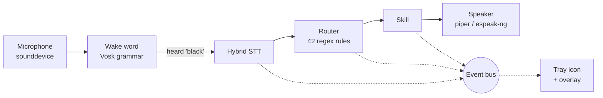
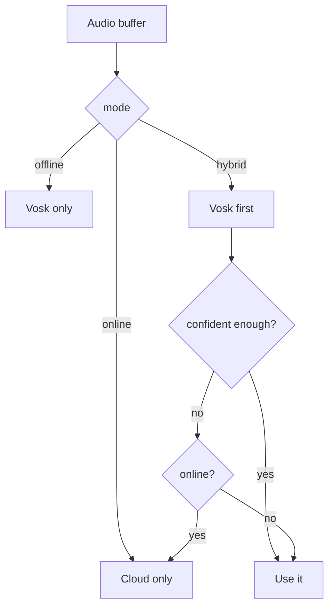

# Architecture

How a spoken sentence becomes an action.



Solid arrows are the data path. Dotted arrows are events — the UI never touches
the audio layer directly, it only subscribes.

## The layers

| Module | Responsibility |
|---|---|
| `blackvoice/audio/` | Microphone capture, speech recognition, speech output, wake word |
| `blackvoice/nlu/` | Turning a transcript into an `Intent` |
| `blackvoice/skills/` | Doing the thing |
| `blackvoice/core/` | Event bus, logging, the shell safety guard |
| `blackvoice/ui/` | Tray icon, popup overlay, the painted logo |
| `blackvoice/app.py` | The engine — audio loop, state machine, confirmations |

## The audio loop

`Engine._loop()` runs on its own thread:

1. Read a block from the microphone (16 kHz, 16-bit mono, 8000 samples)
2. Feed it to the wake-word detector
3. On a hit — or when the tray icon is clicked — enter a conversation

A conversation is one activation: listen, understand, act, answer.

### Wake word

Vosk accepts a **restricted grammar**, which turns the general recogniser into a
cheap keyword spotter: it only has to decide between the wake phrases and
`[unk]`. That keeps idle CPU low, which matters for something that sits in the
tray all day.

If grammar mode is unavailable, it degrades to fuzzy matching over normal partial
results, at a similarity ratio of 0.78.

### Endpointing

Recording stops on **silence**, not on Vosk's own utterance boundaries:

```
level >= silence_threshold  ->  speech, reset the silence counter
level <  silence_threshold  ->  silence, accumulate
silence >= silence_timeout  ->  stop recording
```

Doing it on the audio level rather than the recogniser means it behaves
identically when only the cloud path exists.

## Hybrid recognition



With `language: "both"`, the English and Hindi models each transcribe the **same
buffer** and the higher average word confidence wins. That is the whole trick
behind Hinglish: rather than detecting the language first, both are tried and the
one that fits better is kept.

Connectivity is probed with a 1-second TCP connect to `8.8.8.8:53`, cached for 20
seconds so it is not repeated per utterance.

## Intent routing

A rule is a regex with optional named groups; a named group becomes a slot.

```python
Rule("volume_set", "system", "volume_set", [
    r"\b(?:set\s+)?volume\s*(?:to|at|=|par)?\s*(?P<value>\d{1,3})\b",
    r"\b(?:awaaz|आवाज़)\s*(?P<value>\d{1,3})\s*kar(?:o|do)?\b",
])
```

Rules are tried **in order, first match wins**, so ordering is part of the
design:

- Specific rules come before general ones
- The generic `open X` / `close X` rules are tried **last**, otherwise
  `open downloads` would never reach the folder rule and `run command df -h`
  would be read as an application named *“command df -h”*
- Two rules get a second look in `Router._is_bad_match` — `calculate` needs a
  real operator, and `open`/`close` reject question-shaped phrases

Anything matching nothing becomes `ai.ask`, so an unrecognised sentence is
answered rather than rejected.

## Skills

Every skill implements one method:

```python
class Skill(ABC):
    name: str

    @abstractmethod
    def handle(self, intent: Intent) -> Reply: ...
```

`Reply` carries what to say, what to display, whether it succeeded, and
optionally a confirmation prompt with a callback:

```python
Reply(
    speech="Should I really shut down? Say yes to confirm.",
    confirm="Shut down the computer?",
    on_confirm=lambda: self._really_shut_down(),
)
```

The engine holds that callback as a `PendingConfirmation` for 30 seconds. A
“yes” runs it; a “no”, a “stop”, a different command, or the timeout all drop it.

`SkillRegistry.dispatch` wraps every call in a try/except — a skill that raises
returns an error reply instead of taking down the audio loop.

## Portability

Linux desktops disagree about which tools are installed, so nothing is assumed.
Every action probes a list of candidates and uses the first one present:

| Action | Tried in order |
|---|---|
| Volume | `wpctl` (PipeWire) → `pactl` (PulseAudio) → `amixer` (ALSA) |
| Brightness | `brightnessctl` → `light` → `/sys/class/backlight` |
| Screenshot | `gnome-screenshot` → `spectacle` → `grim` → `scrot` → `import` → `maim` |
| Lock | `loginctl` → `xdg-screensaver` → `gnome-screensaver` → `swaylock` → `i3lock` → `dm-tool` |
| Speech | `piper` → `espeak-ng` → `spd-say` → `pyttsx3` |
| Browser | `xdg-open` → `gio` → `firefox` → `chromium` |

This is why it works on GNOME, KDE, Xfce and tiling window managers without
configuration.

## Threads

| Thread | Runs |
|---|---|
| main | Qt event loop, tray icon, overlay |
| `engine` | Audio loop, recognition, skill dispatch |
| `tts` | Speech output queue |
| timers | One short-lived thread per timer or reminder |

The UI must only be touched from the Qt thread, so the engine publishes to the
event bus and `BusBridge` re-emits each event as a Qt signal with
`QueuedConnection`. That hop is what makes it safe.

`Speaker.say()` returns immediately and queues; `stop()` kills the current
utterance mid-word.

## Graceful degradation

Every optional dependency is imported lazily and its absence is handled:

| Missing | Result |
|---|---|
| `vosk` or models | No offline recognition; hybrid mode falls back to the cloud |
| `PyQt6` | Falls back to headless mode with a message |
| `sounddevice` / PortAudio | Clear error naming the package to install |
| `speech_recognition` | No cloud fallback; offline still works |
| espeak-ng and friends | Replies are printed instead of spoken |
| `psutil` | Battery and system-info commands report why |

`blackvoice doctor` reports all of this in one place.

## Source layout

```
blackvoice/
├── app.py            engine: audio loop, state machine, confirmations
├── cli.py            run · text · setup · doctor · devices · say · config
├── config.py         dataclass config + environment overrides
├── audio/
│   ├── mic.py        microphone stream, RMS metering
│   ├── stt.py        hybrid recognition
│   ├── tts.py        speech output
│   └── wake.py       wake-word detection
├── nlu/
│   ├── intents.py    42 rules, Hindi + English
│   └── router.py     matching and the AI fallback
├── skills/
│   ├── base.py       Skill, Reply, SkillRegistry
│   ├── system.py     apps, volume, brightness, power, radios
│   ├── files.py      search, folders, disk
│   ├── terminal.py   guarded shell access
│   ├── ai.py         Ollama / Claude / OpenAI
│   ├── utils.py      clock, weather, timers, notes, media, maths
│   └── control.py    help, cancel, sleep, yes/no
├── ui/
│   ├── tray.py       tray icon, menu, bus bridge
│   ├── overlay.py    popup card and waveform
│   └── icons.py      the logo, painted with QPainter
└── core/
    ├── bus.py        publish/subscribe
    ├── logs.py       console + rotating file
    └── safety.py     shell guard
```

## Next

→ **[Security Model](Security-Model)** — the guard in detail
→ **[Writing Skills](Writing-Skills)** — add your own
